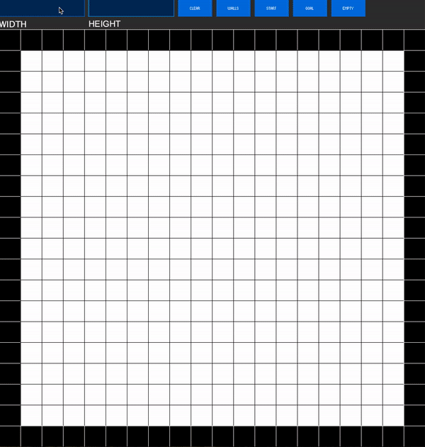
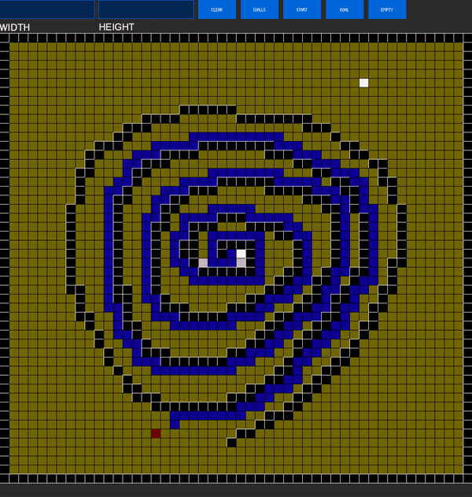

# Pathfinding Visualization

A tool I created from scratch using processing to better understand A* and greedy algorithms. (From my Artificial Intelligence and Algorithms courses at Queen's University.)

## Features
* Point and click maze creating to understand the A* and Greedy algorithm better
* Change width and height of maze (Larger values crash the app)
* 'a' key simulates A* cardinally searching for the goal
* 's' key simulates A* diagonally searching for the goal
* 'g' key simulates Greedy search cardinally searching for the goal
* 'h' key simulates Greedy search diagonally searching for the goal
* 'p' key saves the current maze to a text file in the format for my AI course. (probably not useful for you, sorry)

## A* Searching

## Greedy Searching

## Installation
* Clone repo and open the folder for your OS and run the executable
* Mac OS may not allow you to run from unidentified developers, if so right click on the executable and select open

//
//  Created by John David Anthony on 2019-03-16.
//  Copyright © 2019 John David Anthony. All rights reserved.
//
